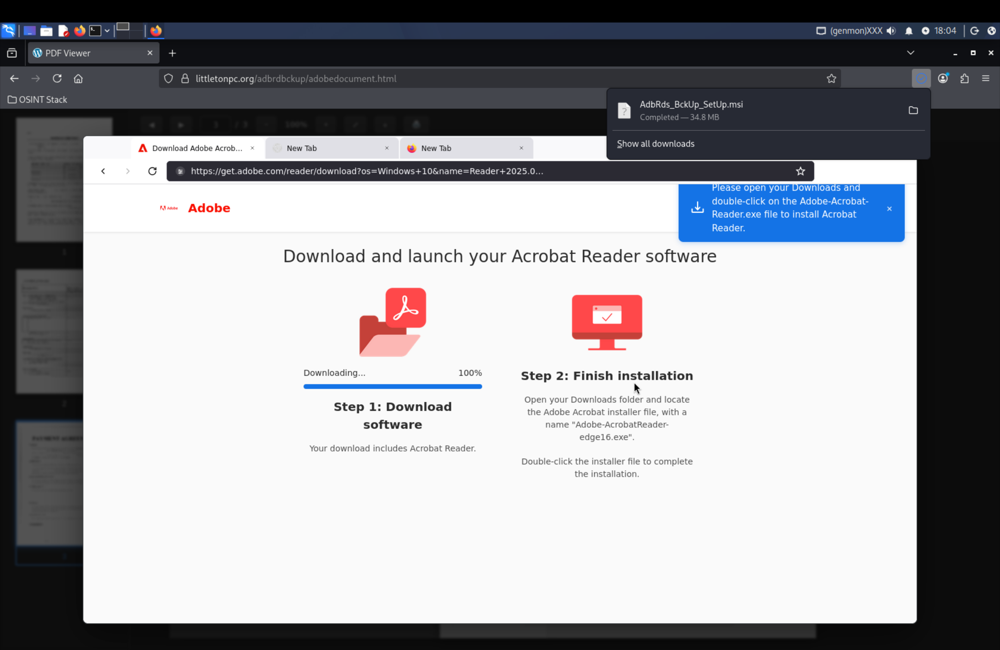
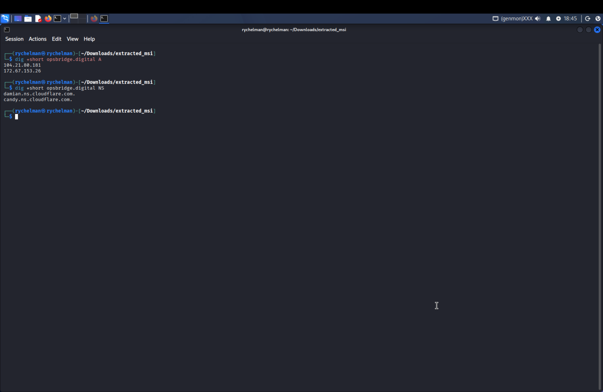

# Incident Response & Static Malware Analysis: OpsBridge C2 Campaign

An end-to-end DFIR case study detailing the containment of an enterprise Microsoft 365 mailbox compromise and static malware analysis of an Extended Validation (EV) signed Windows installer delivering the OpsBridge C2 agent.

---

## Executive Summary

An unauthorized login occurred on an enterprise Microsoft 365 mailbox originating from an external IP address. The threat actor created hidden inbox rules to conceal outgoing traffic and distributed a zero-hour phishing blast to approximately 450 contacts.

Triage of the distributed payload revealed an evasive multi-stage campaign delivering an EV-signed Windows Installer (MSI) configured to deploy a persistent Remote Access Trojan (RAT) connected to `opsbridge.digital`.

---

## Incident Timeline & Mailbox Remediation

* **Initial Access:** Unauthorized web session established on the mailbox.
* **Defense Evasion:** Threat actor created an inbox rule redirecting replies and delivery failures straight to Deleted Items.
* **Phishing Blast:** 450 recipient addresses targeted across three batches with a fake PDF update notice.
* **Containment Executed:**
  * Deleted malicious inbox rules to restore normal mail flow.
  * Reset account credentials.
  * Revoked all active session tokens via Entra / M365 Admin (Sign out everywhere) to sever active remote sessions.
  * Sent a liability-neutral advisory notice to all affected contacts.

---

## Static Malware Analysis (Kali Linux Sandbox)

Static triage was performed inside an isolated Kali Linux virtual machine to deconstruct the Windows binaries without dynamic execution risks.

### Stage 1: Phishing Lure & Delivery
* **Delivery Site:** Compromised WordPress installation (`littletonpc.org`).
* **Lure Mechanism:** Fake Adobe Acrobat Reader download portal serving `AdbRds_BckUp_SetUp.msi` (34.8 MB).




### Stage 2: MSI Deconstruction
Using `7z` to unpack the compound installer without executing binaries:

```bash
# Unpack the outer MSI wrapper
7z x AdbRds_BckUp_SetUp.msi -o./extracted_msi/

# Extract the internal cabinet payload
cd extracted_msi
7z x cab1.cab -o./cab_contents/
```


### Stage 3: Payload Configuration & Persistence
Inspecting the extracted binary (`AgentExe` / `OpsBridgeAgent.exe`) revealed an embedded JSON configuration controlling C2 connectivity:

```json
{
  "server_url": "[https://opsbridge.digital](https://opsbridge.digital)",
  "enrollment_key": "e2b5d59c80f0a816b3d58728f9552898",
  "auto_persist": true,
  "auto_update": true
}
```

* **Privilege Escalation:** Manifest enforces `requireAdministrator` to trigger Windows UAC elevation.
* **Persistence:** `auto_persist: true` automatically registers a background service or scheduled task.
* **Code Signing Evasion:** Signed with an EV certificate (`SSLcom-SubCA-EV-CodeSigning-RSA-4096-R3`), bypassing Windows SmartScreen and yielding a 0/63 detection rate on VirusTotal at delivery.


---

## Threat Intelligence & Infrastructure Mapping

* **Domain Registration:** Registered through Namecheap (IANA 303) on February 2, 2026.
* **CDN Masking:** Fronted by Cloudflare Anycast IP addresses (`104.21.80.181`, `172.67.153.26`).
* **Unmasked Origin Server:** Historical passive DNS data identified an unproxied Linode / Akamai VPS at `69.164.245.216`.
* **Subdomain Infrastructure:**
  * `api.opsbridge.digital`: Agent beaconing and C2 communications.
  * `upload.opsbridge.digital` (`163.245.221.212`): Staging server for exfiltrated data.
  * `opsbridge.digital`: Operator management console.




---

## Detection Engineering & Takedown Actions

* Reported malicious code-signing certificate serial numbers to SSL.com for revocation.
* Submitted abuse and takedown reports to Cloudflare, Namecheap, and Linode.
* Created custom YARA signatures to detect compiled OpsBridge binary strings.
